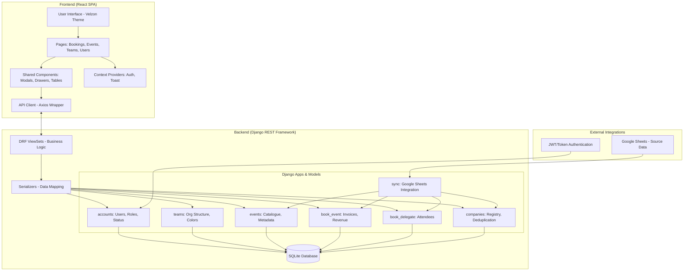

# Project Architecture Graph

The following diagram illustrates the high-level architecture of the Linq CRM, showing the relationship between the Frontend, Backend, and External Integrations.



---

## Architecture Components Overview

### 1. Frontend (React 18)
- **State Management**: Uses React Context (`AuthContext`, `ToastContext`) for global application state.
- **Routing**: `react-router-dom` handles navigation between specialized modules.
- **Interactions**: `@dnd-kit` powers the complex drag-and-drop team management workspace.
- **API Layer**: Centralized `client.js` handles authorization headers and error interceptors.

### 2. Backend (Django 5.x + DRF)
- **RBAC**: Custom permission classes (`IsAdminRole`) enforce role-based access control.
- **API Layer**: ViewSets provide clean RESTful endpoints for CRUD and specialized actions (status toggling, team movement).
- **Data Integrity**: Phased migrations and relational modeling ensure zero data loss during structural upgrades.

### 3. External Integrations
- **Google Sheets Sync**: A background service that maps spreadsheet datasets to internal CRM models, handling updates and new record ingestion.
- **Deduplication Engine**: A specialized "Upsert" logic in the `companies` app prevents duplicate corporate records during imports.

### 4. Data Flow Path
1. **User Action**: Admin initiates a "Team Change" in the UI.
2. **API Request**: Axios client sends a `PATCH` request to `/api/users/{id}/move-team/`.
3. **ViewSet Processing**: `UserViewSet` validates the request and verifies admin permissions.
4. **Model Mutation**: The `User` model updates its `team` ForeignKey.
5. **UI Update**: Frontend receives the updated user object and performs an optimistic update to the dashboard.
## 📂 Project Folder Structure

```text
linqcrm_project/
├── backend/                  # Django REST API
│   ├── accounts/             # User Management & Auth
│   ├── book_delegate/        # Attendee Records
│   ├── book_event/           # Invoices & Revenue
│   ├── companies/            # Corporate Registry
│   ├── config/               # Project Settings & URLs
│   ├── events/               # Event Catalogue
│   ├── services/             # Google Sheets Integration
│   ├── teams/                # Organizational Units
│   └── manage.py
├── frontend/                 # React SPA
│   ├── public/               # Static Assets
│   └── src/
│       ├── api/              # Axios API Wrappers
│       ├── components/       # UI Component Library
│       │   ├── layout/       # Header & Sidebar
│       │   ├── teams/        # Dnd Workspace Comps
│       │   ├── users/        # User Modals & Drawers
│       │   └── ui/           # Generic Table/Cards
│       ├── contexts/         # Auth & Notification State
│       ├── hooks/            # Custom React Hooks
│       ├── pages/            # View-level Components
│       ├── App.jsx           # Root App Shell
│       └── index.css         # Global Design System
└── design_overview.md        # Technical Design Docs
```
